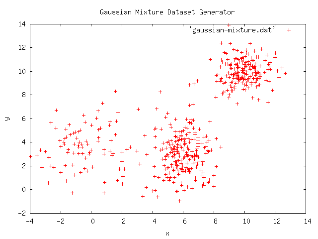

# Gaussian Mixture
Generate a stream of vectors according to a predefined mixture of gaussians.


## Example
```java
import info.debatty.java.datasets.reuters.*;

public class MyClass {
    public static void main(String[] args) {
        Dataset gaussian_mixture = new Dataset();
        gaussian_mixture.addCenter(
                new Center(
                        2,							// weight
                        new double[]{10.0, 10.0},	// center
                        new double[]{1.0, 1.0}));	// deviation

        gaussian_mixture.addCenter(
                new Center(
                        2,
                        new double[]{6.0, 3.0},
                        new double[]{1.0, 1.5}));

        gaussian_mixture.addCenter(
                new Center(
                        1,
                        new double[]{0.0, 4.0},
                        new double[]{2.0, 2.0}));

        Iterator<Double[]> iterator = gaussian_mixture.iterator();
        for (int i = 0; i < 500; i++) {
            println(iterator.next());
        }
    }

    private static void println(Double[] array) {
        for (Double value : array) {
            System.out.print("" + value + " ");
        }
        System.out.print("\n");
    }
}
```

Will produce something like

```
4.659833760799799 3.4363619496948736 
8.693042174471389 11.582794052352753 
10.736209908747439 9.67988698683881 
...
```

Which can be plotted with gnuplot:


