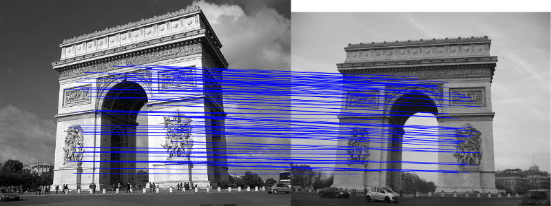

# SIFT dataset
The Scale Invariant Feature Transform (SIFT) is an algorithm that (as the name says) transforms an image into a set of scale and rotation independant features. This may be roughly compared to vector representation of an image, and is usually used to perform image classification, object recognition or panorama stitching.



https://en.wikipedia.org/wiki/Scale-invariant_feature_transform

This dataset will provide you with a stream of stream descriptors from a directory containing pictures (one descriptor per picture).

## Download
A lot of picture datasets can be downloaded on the Internet. The most used ones for reaseach are:
* [Caltech 101](http://www.vision.caltech.edu/Image_Datasets/Caltech101/) contains images from 101 categories
* [Caltech 256](http://www.vision.caltech.edu/Image_Datasets/Caltech256/) contains 30607 images from 256 categories
* [MICC-Flickr101](http://www.micc.unifi.it/vim/datasets/micc-flickr-101/) consists of Flick images
* [Oxord buildings dataset](http://www.robots.ox.ac.uk/~vgg/data/oxbuildings/index.html)


## Example
```java
import info.debatty.java.datasets.enron.Dataset;
import info.debatty.java.datasets.enron.Email;

public class EnronExample {

    public static void main(String[] args) throws Exception {
         Dataset enron_dataset = new Dataset(
                DBLP.class.getClassLoader().getResource("mini-enron")
                .getFile());

        for (Email email : enron_dataset) {
            // This would display the MIME text
            //System.out.println(email.getRaw());

            System.out.println(email.getUser());

            // This might be "inbox", "sent", "archive/holidays" etc.
            System.out.println(email.getMailbox());

            System.out.println(email.getSubject());
            System.out.println(email.getFrom());
            for (String address : email.getTo()) {
                System.out.println(address);
            }

            System.out.println("---");
        }
    }
}
```

Will display something like

```
badeer-r
<32086953.1075863603392.JavaMail.evans@thyme>
memo_s
Code of Ethics
office.chairman@enron.com
all.worldwide@enron.com
---
badeer-r
<12296501.1075863603653.JavaMail.evans@thyme>
memo_s
The New Power Company
office.chairman@enron.com
all.america@enron.com
---
badeer-r
<32156305.1075863603445.JavaMail.evans@thyme>
memo_s
2000 Chairman's Award
enron.announcements@enron.com
all.worldwide@enron.com
---
```